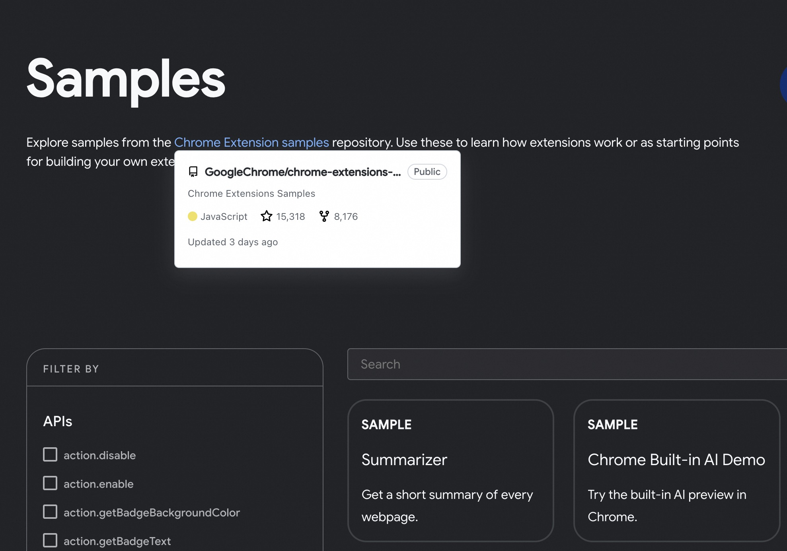
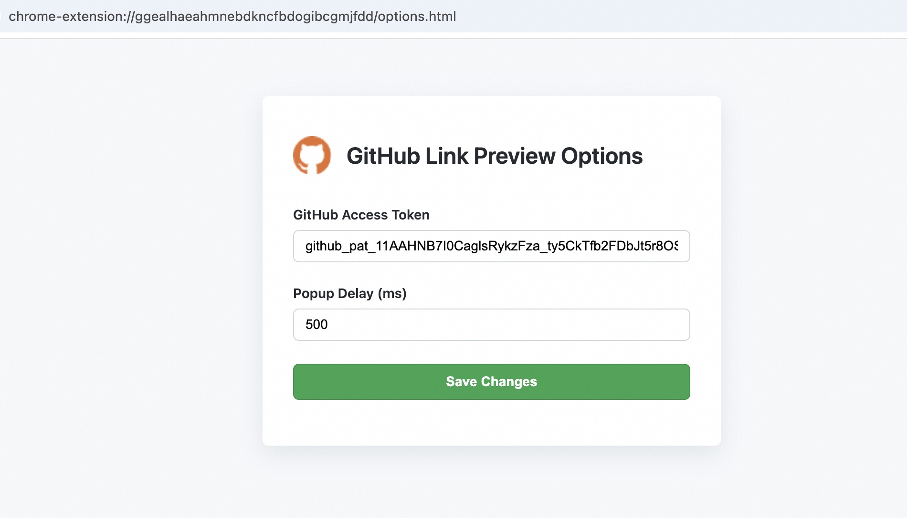

# Github Link Preview

GitHub Link Preview is a Chrome extension that enhances your browsing experience by displaying elegant preview popups when you hover over GitHub repository or profile links.

## Installation

Install the extension directly from the Chrome Web Store: [GitHub Link Preview on Chrome Web Store](https://chromewebstore.google.com/detail/github-link-preview/maicebkpagigefioggjaboaodmaeklok)

## Configuration

- **Switch**: Click the extension icon in your browser toolbar, then toggle the 'Enable Preview Popup Globally' switch.

    

- **Options**: Click the extension icon in your browser toolbar, then select 'Go to Options'.

    

  - **GitHub Access Token** _(Optional)_: Use your personal GitHub access token to invoke GitHub APIs with higher rate limits, allowing for a more robust experience.

## References

- [REST API endpoints for repositories | GitHub API](https://docs.github.com/en/rest/repos/repos?apiVersion=2022-11-28)
- [Authenticating to the REST API | GitHub API](https://docs.github.com/en/rest/authentication/authenticating-to-the-rest-api?apiVersion=2022-11-28)
